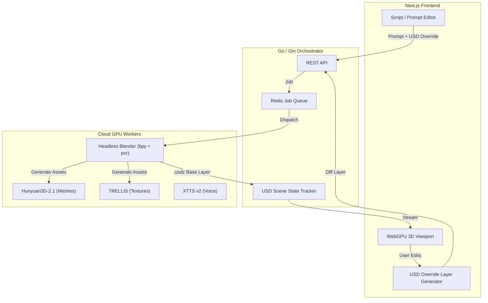

# 🎬 AI Blender — Human-in-the-Loop 3D AI Co-pilot

A next-generation web platform that converts text prompts, scripts, and audio into fully assembled, editable 3D scenes and animations. Unlike black-box "text-to-video" models, AI Blender acts as a master orchestrator — delegating to specialized AI models, assembling via headless Blender, and streaming interactive 3D previews to your browser in real-time.

## Architecture



## Tech Stack

| Layer | Technology |
|---|---|
| Frontend | Next.js 15, TypeScript, Tailwind CSS, React Three Fiber, WebGPU |
| Orchestrator | Go, Gin, Redis |
| Assembly Engine | Python, Blender (headless), OpenUSD (`pxr`) |
| AI Models | Hunyuan3D-2.1, TRELLIS, XTTS v2, LivePortrait |
| Scene Format | OpenUSD (`.usdz`) with layered overrides |

## Quick Start

### Prerequisites

- [Docker](https://www.docker.com/) & Docker Compose
- [Node.js 22+](https://nodejs.org/) (for local frontend dev)
- [Go 1.24+](https://golang.org/) (for local orchestrator dev)
- [Python 3.11+](https://www.python.org/) (for local worker dev)

### Run Everything

```bash
# Clone and enter the repo
cd ai_blender

# Copy environment config
cp .env.example .env

# Start all services
make dev
```

### Run Individual Services

```bash
make dev-web            # Next.js on :3000
make dev-orchestrator   # Go API on :8080
```

## Project Structure

```
ai_blender/
├── apps/
│   ├── web/                # Next.js frontend
│   ├── orchestrator/       # Go + Gin orchestrator backend
│   └── blender-worker/     # Python headless Blender assembly engine
├── proto/                  # Shared Protobuf / gRPC definitions
├── infra/docker/           # Production Dockerfiles
├── docker-compose.yml      # Local dev environment
└── Makefile                # Unified build commands
```

## The Secret Sauce: OpenUSD Layering

We use OpenUSD composition arcs as the single source of truth for scene state:

1. **Base Layer** — AI assembles generated assets into a `.usdz` via headless Blender
2. **Stream** — `.usdz` is sent to the browser and rendered via WebGPU
3. **Override Layer** — User edits in the viewport produce a lightweight USD diff
4. **Context Loop** — The override layer is fed back to the AI with the next prompt, preserving all human edits

## License

Proprietary — All rights reserved.
