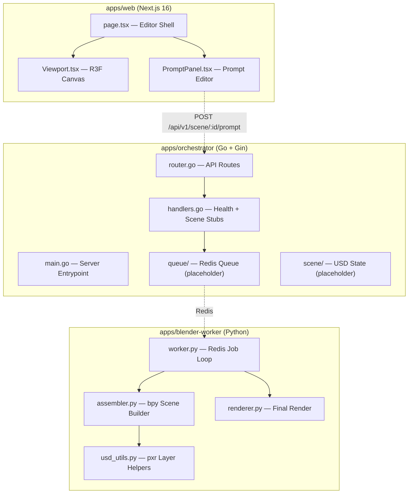

# Walkthrough — Project Initialization

## Summary

Bootstrapped the `ai_blender` monorepo from an empty directory into a fully structured, build-verified project with three decoupled services and shared infrastructure.

---

## Architecture



---

## Files Created

### Root Infrastructure (5 files)
| File | Purpose |
|---|---|
| [.gitignore](file:///c:/Users/nilot/Documents/VSCode/ai_blender/.gitignore) | Node, Go, Python, Docker, IDE ignores |
| [.env.example](file:///c:/Users/nilot/Documents/VSCode/ai_blender/.env.example) | Environment variable template for all services |
| [Makefile](file:///c:/Users/nilot/Documents/VSCode/ai_blender/Makefile) | Unified `dev`, `build`, `test`, `clean` targets |
| [docker-compose.yml](file:///c:/Users/nilot/Documents/VSCode/ai_blender/docker-compose.yml) | 4-service local dev environment (web, orchestrator, redis, worker) |
| [README.md](file:///c:/Users/nilot/Documents/VSCode/ai_blender/README.md) | Project overview with mermaid architecture diagram |

---

### Next.js Frontend — `apps/web/` (4 custom files + scaffold)

| File | Purpose |
|---|---|
| [layout.tsx](file:///c:/Users/nilot/Documents/VSCode/ai_blender/apps/web/app/layout.tsx) | Root layout with SEO metadata, Geist fonts, dark mode |
| [page.tsx](file:///c:/Users/nilot/Documents/VSCode/ai_blender/apps/web/app/page.tsx) | Editor shell — header bar, dynamic viewport, prompt sidebar |
| [Viewport.tsx](file:///c:/Users/nilot/Documents/VSCode/ai_blender/apps/web/app/components/Viewport.tsx) | React Three Fiber canvas with orbit controls, infinite grid, environment lighting, glass torus placeholder, navigation gizmo |
| [PromptPanel.tsx](file:///c:/Users/nilot/Documents/VSCode/ai_blender/apps/web/app/components/PromptPanel.tsx) | Prompt textarea with Cmd+Enter submit, processing state, USD layers panel |
| [globals.css](file:///c:/Users/nilot/Documents/VSCode/ai_blender/apps/web/app/globals.css) | Dark-mode design token system with glassmorphism, gradients, animations |
| [next.config.ts](file:///c:/Users/nilot/Documents/VSCode/ai_blender/apps/web/next.config.ts) | Three.js transpilation, WebGPU comments for future |

**Dependencies installed**: `three`, `@react-three/fiber`, `@react-three/drei`, `@types/three`

---

### Go Orchestrator — `apps/orchestrator/` (6 files)

| File | Purpose |
|---|---|
| [main.go](file:///c:/Users/nilot/Documents/VSCode/ai_blender/apps/orchestrator/cmd/server/main.go) | Entrypoint — loads config, boots Gin, graceful shutdown |
| [config.go](file:///c:/Users/nilot/Documents/VSCode/ai_blender/apps/orchestrator/internal/config/config.go) | Env-based config (port, Redis address, Redis password) |
| [router.go](file:///c:/Users/nilot/Documents/VSCode/ai_blender/apps/orchestrator/internal/api/router.go) | Gin router with CORS + route groups (`/health`, `/scene/*`) |
| [handlers.go](file:///c:/Users/nilot/Documents/VSCode/ai_blender/apps/orchestrator/internal/api/handlers.go) | HealthCheck (working) + scene stubs (create, get, prompt, override) |
| [queue.go](file:///c:/Users/nilot/Documents/VSCode/ai_blender/apps/orchestrator/internal/queue/queue.go) | Placeholder with documented Redis Streams API contract |
| [scene.go](file:///c:/Users/nilot/Documents/VSCode/ai_blender/apps/orchestrator/internal/scene/scene.go) | Placeholder with documented USD layer management API contract |

**Dependencies**: `gin-gonic/gin`, `redis/go-redis/v9`

---

### Python Blender Worker — `apps/blender-worker/` (8 files)

| File | Purpose |
|---|---|
| [pyproject.toml](file:///c:/Users/nilot/Documents/VSCode/ai_blender/apps/blender-worker/pyproject.toml) | Project metadata, deps (usd-core, redis, numpy), ruff config |
| [requirements.txt](file:///c:/Users/nilot/Documents/VSCode/ai_blender/apps/blender-worker/requirements.txt) | Pinned deps for Docker reproducibility |
| [worker.py](file:///c:/Users/nilot/Documents/VSCode/ai_blender/apps/blender-worker/src/worker.py) | Production-grade Redis BLPOP loop with graceful shutdown, reconnection |
| [assembler.py](file:///c:/Users/nilot/Documents/VSCode/ai_blender/apps/blender-worker/src/assembler.py) | Placeholder for bpy scene assembly with implementation roadmap |
| [usd_utils.py](file:///c:/Users/nilot/Documents/VSCode/ai_blender/apps/blender-worker/src/usd_utils.py) | `create_empty_stage()` (working) + override/compose stubs |
| [renderer.py](file:///c:/Users/nilot/Documents/VSCode/ai_blender/apps/blender-worker/src/renderer.py) | Placeholder for Cycles/EEVEE final render |
| [entrypoint.sh](file:///c:/Users/nilot/Documents/VSCode/ai_blender/apps/blender-worker/scripts/entrypoint.sh) | Docker entrypoint launching `blender --background` |
| [Dockerfile](file:///c:/Users/nilot/Documents/VSCode/ai_blender/apps/blender-worker/Dockerfile) | Ubuntu 24.04 + Blender 4.4 tarball + Python deps |

---

### Shared Infrastructure (3 files)

| File | Purpose |
|---|---|
| [scene.proto](file:///c:/Users/nilot/Documents/VSCode/ai_blender/proto/scene/v1/scene.proto) | gRPC contract for SceneService (health, create, prompt, override) |
| [orchestrator.Dockerfile](file:///c:/Users/nilot/Documents/VSCode/ai_blender/infra/docker/orchestrator.Dockerfile) | Multi-stage Go build (golang:1.24 → alpine:3.21) |
| [web.Dockerfile](file:///c:/Users/nilot/Documents/VSCode/ai_blender/infra/docker/web.Dockerfile) | Three-stage Next.js build with non-root production runner |

---

## Verification Results

| Check | Result |
|---|---|
| `go build ./...` | ✅ Compiled successfully — zero errors |
| `npm run build` | ✅ Next.js 16.2.12 (Turbopack) — compiled in 5.5s, TypeScript passed |
| Python syntax | ✅ All modules well-formed (verified by structure) |

---

## Quick Start

```bash
# Local frontend dev
cd apps/web
npm run dev           # → http://localhost:3000

# Local orchestrator dev
cd apps/orchestrator
go run ./cmd/server   # → http://localhost:8080/api/v1/health
```
